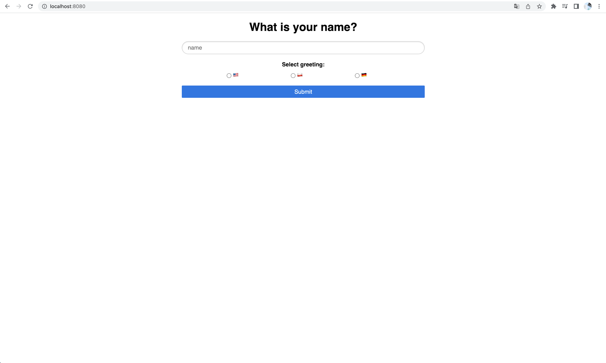
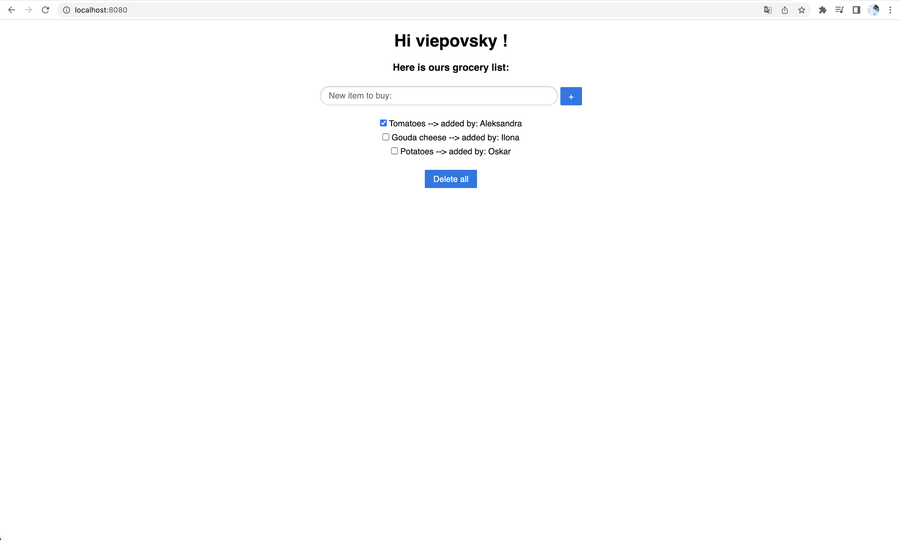
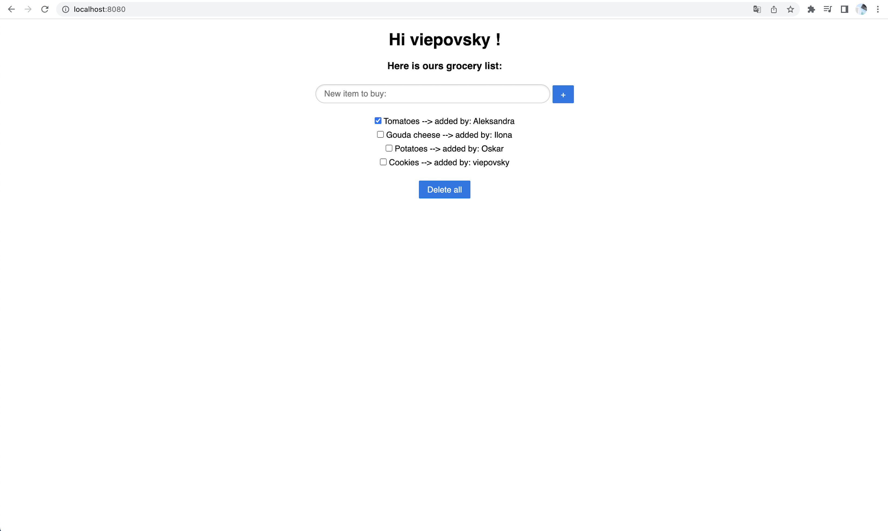

# Grocery list
## Description

This is a simple `CRUD` application that I developed to practice and gain knowledge of coding **`REST API without using Spring`**. 
My main goal was to better understand what Spring really does and how it helps in building REST applications. 
The application consists of a backend connected with a frontend. 
Users can enter their name, choose a greeting, and start adding or marking items on a grocery list, or they can delete all items from the list.
The list is saved in the database, so each time you visit the site, it remains the same as when you left it.

## Technologies used
**No Spring**
- Languages: Java, HTML, JavaScript
- Hibernate
- Servlet
- Jetty
- Flyway
- H2 database

I am currently using the H2 database, which is stored in a file. Flyway is being used to initialize tables with records in the database. The application is currently hosted using Jetty. Hibernate is currently being used for connecting with the database and the servlet is being used to handle incoming requests and send responses.

## How to run
1. Clone the repository
2. Run the application by typing `./mvnw jetty:run` or by running App class in your IDE.
3. Open `http://localhost:8080/` and try the application.
4. If you want to restore db with initial data, delete the H2 database file named: `db.mv.db` and type `./mvnw flyway:migrate` in terminal

## Application views:

### Start View

### Grocery list view

### Grocery list view after adding item

